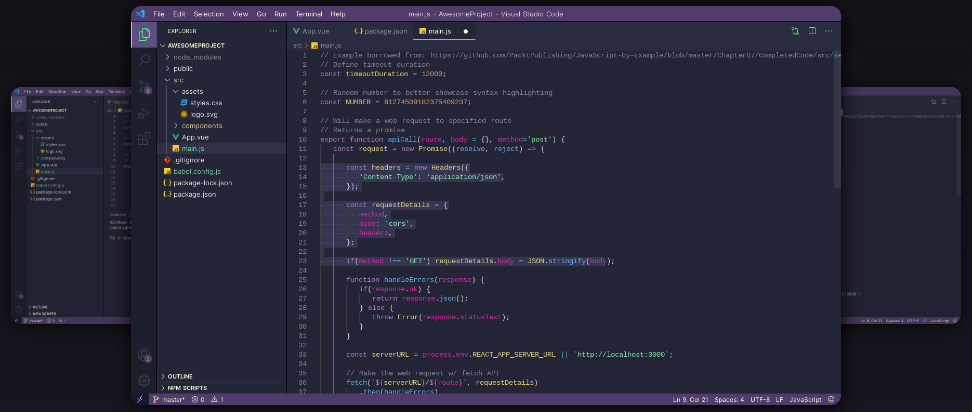
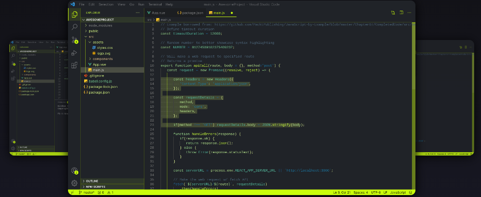
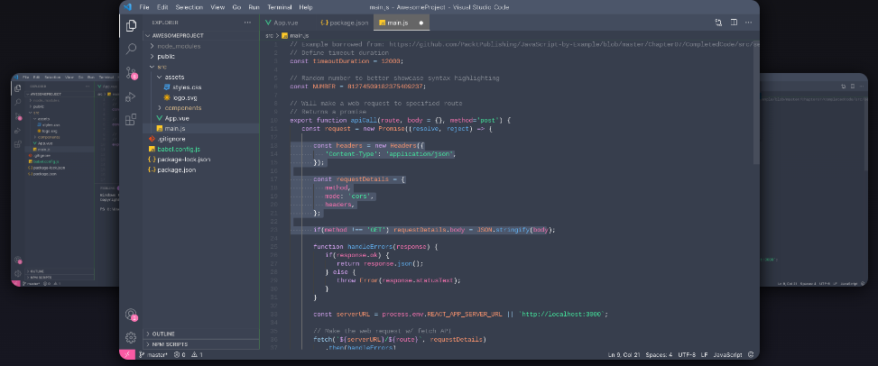
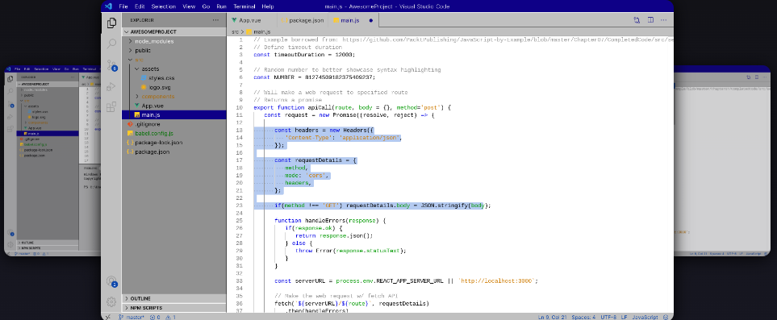
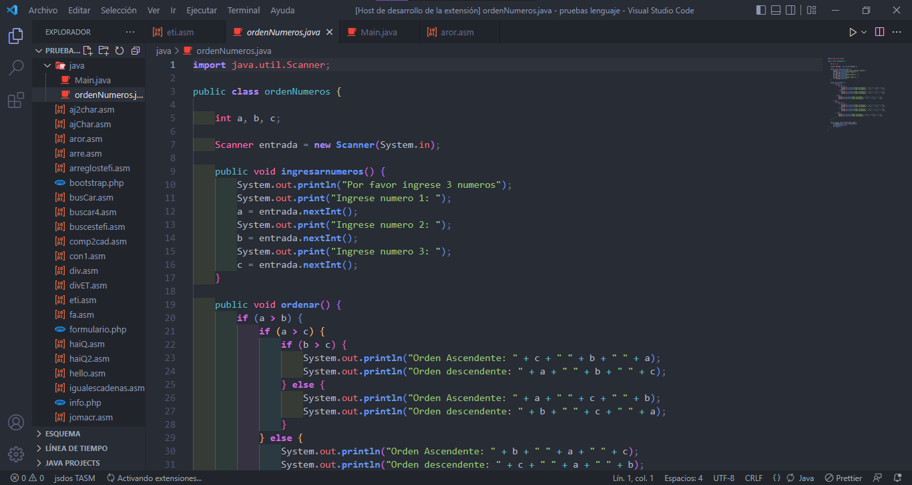

<a name="readme-top"></a>

[![Contributors][contributors-shield]][contributors-url]
[![Forks][forks-shield]][forks-url]
[![Stargazers][stars-shield]][stars-url]
[![Issues][issues-shield]][issues-url]
[![MIT License][license-shield]][license-url]
[![LinkedIn][linkedin-shield]][linkedin-url]


<!-- PROJECT LOGO -->
<br />
<div align="center">
  <a href="https://github.com/EmePin/aim-themes">
    
  </a>


  <h3 align="center">aim-themes-README</h3>

  <p align="center">
    Aim Themes is a collection of all my favorite themes I've created and others I've found in Visual Studio Code with a few modifications.
    <br />
    <a href="https://github.com/EmePin/aim-themes"><strong>Explore the docs »</strong></a>
    <br />
    <br />
    <a href="https://marketplace.visualstudio.com/publishers/EmeAim">Download</a>
    ·
    <a href="https://github.com/EmePin/aim-themes/issues">Report Bug</a>
    ·
    <a href="https://github.com/EmePin/aim-themes/issues">Request Feature</a>
  </p>
</div>

<!-- TABLE OF CONTENTS -->

  <summary><strong> Table of Contents 👀</strong></summary>
  <ol>
    <li>
      <a href="#about-the-project">About The Project</a>
      <ul>
        <li><a href="#built-with">Built With</a></li>
      </ul>
    </li>
    <li>
      <a href="#getting-started">Getting Started</a>
      <ul>
        <li><a href="#installation">Installation</a></li>
      </ul>
    </li>
    <li><a href="#usage">Usage</a></li>
    <li><a href="#roadmap">Roadmap</a></li>
    <li><a href="#contributing">Contributing</a></li>
    <li><a href="#license">License</a></li>
    <li><a href="#contact">Contact</a></li>
    <li><a href="#acknowledgments">Acknowledgments</a></li>
  </ol>

<!-- ABOUT THE PROJECT -->

## About The Project

Aim Themes is a collection of all my favorite themes I've created and others I've found in Visual Studio Code with a few modifications.


  <a href="https://github.com/EmePin/aim-themes">
    
  </a>

<a href="https://github.com/EmePin/aim-themes/archive/refs/heads/main.zip">Descargar código fuente</a>
<p align="right">(<a href="#readme-top">back to top</a>)</p>

### Built With

<br>

-   [![node][node-shield]][node-url]
-   [![Css][json-shield]][json-url]


<p align="right">(<a href="#readme-top">back to top</a>)</p>

<!-- GETTING STARTED -->

## Getting Started
Sólo debes descargar la extensión de [aquí](https://marketplace.visualstudio.com/items?itemName=EmeAim.aim).
Para obtener una copia local de este repositorio se puede clonar o [descargar](https://github.com/EmePin/aim-themes/archive/refs/heads/main.zip).
### Prerequisites

```sh
  git clone https://github.com/EmePin/aim-themes.git
```


### Installation
Para Crear tus propios temas se ocupará node y de preferencia gitbash asociado previamente a github.

En una carpeta donde se pueda alojar el proyecto abrimos la terminal y ponemos los siguientes comandos:


      ```terminal
            npm install -g yo generator-code
            yo code

            What type of extension do you want to create? New Color Theme
            Do you want to import or convert an existing TextMate color theme? No, start fresh
      ```
Después podemos empezar a editar el tema y al terminar:

      ```terminal
           npm install vsce -g
      ```
Luego modificamos el readme
Entramos a  http://dev.azure.com y creamos un token
luego en https://marketplace.visualstudio.com/... y creamos un publisher.

      ```terminal
                vsce login EmeAim
                *colocamos el token*
                vsce package
      ```
<p align="right">(<a href="#readme-top">back to top</a>)</p>

<!-- USAGE EXAMPLES -->

## Usage

A continuación se muestran los temas. 
<br>
1.- Aim-kai🌙
  <a href="https://github.com/EmePin/aim-themes">
    
  </a>
2.- Aim-hack-and-Lima🍋
  <a href="https://github.com/EmePin/aim-themes">
    
  </a>
3.- Aim-Joyful😄
  <a href="https://github.com/EmePin/aim-themes">
    
  </a>
4.- Aim-Windows98🪟
  <a href="https://github.com/EmePin/aim-themes">
    
  </a>

5.- Aim-kai☀️
  <a href="https://github.com/EmePin/aim-themes">
    
  </a>
  
6.-Aim-Fav❤️
  <a href="https://github.com/EmePin/aim-themes">
    
  </a>
  

<p align="right">(<a href="#readme-top">back to top</a>)</p>


## Roadmap


See the [open issues](https://github.com/EmePin/aim-themes/issues) for a full list of proposed features (and known issues).

<p align="right">(<a href="#readme-top">back to top</a>)</p>

<!-- CONTRIBUTING -->

## Contributing

Contributions are what make the open source community such an amazing place to learn, inspire, and create. Any contributions you make are **greatly appreciated**.

If you have a suggestion that would make this better, please fork the repo and create a pull request. You can also simply open an issue with the tag "enhancement".
Don't forget to give the project a star! Thanks again!

1. Fork the Project
2. Create your Feature Branch (`git checkout -b feature/AmazingFeature`)
3. Commit your Changes (`git commit -m 'Add some AmazingFeature'`)
4. Push to the Branch (`git push origin feature/AmazingFeature`)
5. Open a Pull Request

<p align="right">(<a href="#readme-top">back to top</a>)</p>

<!-- LICENSE -->

## License

Distributed under the MIT License. See [LICENSE](https://github.com/EmePin/aim-themes/blob/main/LICENSE.txt) for more information.

<p align="right">(<a href="#readme-top">back to top</a>)</p>

<!-- CONTACT -->

## Contact
[](https://instagram.com/eme_aim) [](https://linkedin.com/in/jahda%c3%ad-p-93aa091b5/) [](https://youtube.com/@aimeepineda8400)

-   **Github** : [EmePin](https://github.com/EmePin/)
-   **Project Link** : [aim-themes](https://github.com/EmePin/aim-themes)

<p align="right">(<a href="#readme-top">back to top</a>)</p>

<!-- ACKNOWLEDGMENTS -->

## Acknowledgments
 
Use this space to list resources you find helpful and would like to give credit to. I've included a few of my favorites to kick things off!

-   [Choose an Open Source License](https://choosealicense.com)
-   [Img Shields](https://github.com/alexandresanlim/Badges4-README.md-Profile#-artificial-intelligence-)
-   [Best-README-Template](https://github.com/othneildrew/Best-README-Template)


<p align="right">(<a href="#readme-top">back to top</a>)</p>


<!-- MARKDOWN LINKS & IMAGES -->
<!-- https://www.markdownguide.org/basic-syntax/#reference-style-links -->

<!-- repo info -->
[contributors-shield]: https://img.shields.io/github/contributors/EmePin/aim-themes.svg?style=for-the-badge
[contributors-url]: https://github.com/EmePin/aim-themes/graphs/contributors
[forks-shield]: https://img.shields.io/github/forks/EmePin/aim-themes.svg?style=for-the-badge
[forks-url]: https://github.com/EmePin/aim-themes/network/members
[stars-shield]: https://img.shields.io/github/stars/EmePin/aim-themes.svg?style=for-the-badge
[stars-url]: https://github.com/EmePin/aim-themes/stargazers
[issues-shield]: https://img.shields.io/github/issues/EmePin/aim-themes.svg?style=for-the-badge
[issues-url]: https://github.com/EmePin/aim-themes/issues
[license-shield]: https://img.shields.io/github/license/EmePin/aim-themes.svg?style=for-the-badge
[license-url]: https://github.com/EmePin/aim-themes/blob/master/LICENSE.txt
[linkedin-shield]: https://img.shields.io/badge/-LinkedIn-black.svg?style=for-the-badge&logo=linkedin&colorB=555
[linkedin-url]: https://www.linkedin.com/in/jahda%C3%AD-p-93aa091b5/

<!-- screenshot -->
[product-screenshot]: images/screenshot.png

<!-- lenguajes usados -->
[js-shield]: https://img.shields.io/badge/JavaScript-323330?style=for-the-badge&logo=javascript&logoColor=F7DF1E
[js-url]: https://developer.mozilla.org/es/docs/Web/JavaScript#tutoriales
[js2-shield]: https://img.shields.io/badge/JavaScript-F7DF1E?style=for-the-badge&logo=javascript&logoColor=black
[css-shield]: https://img.shields.io/badge/CSS3-1572B6?style=for-the-badge&logo=css3&logoColor=white
[css-url]:https://developer.mozilla.org/es/docs/Web/CSS#tutoriales
[html5-shield]: https://img.shields.io/badge/HTML5-E34F26?style=for-the-badge&logo=html5&logoColor=white
[html5-url]: https://developer.mozilla.org/es/docs/Web/HTML#tutoriales_para_principiantes
[json-shield]: https://img.shields.io/badge/json-5E5C5C?style=for-the-badge&logo=json&logoColor=white
[json-url]: https://developer.mozilla.org/es/docs/Learn/JavaScript/Objects/JSON#aprendizaje_activo_trabajando_a_trav%C3%A9s_de_un_ejemplo_de_json
[node-shield]: https://img.shields.io/badge/Node.js-43853D?style=for-the-badge&logo=node.js&logoColor=white
[node-url]: https://nodejs.org/es
[assambly-shield]:https://img.shields.io/badge/Assembly-654FF0?style=for-the-badge&logo=Assembly&logoColor=white
[assambly-url]: https://en.wikipedia.org/wiki/Assembly_language
[xampp]: https://img.shields.io/badge/Xampp-F37623?style=for-the-badge&logo=xampp&logoColor=white
[xampp-url]: https://www.apachefriends.org/es/index.html
[power-bi-shield]:https://img.shields.io/badge/PowerBI-F2C811?style=for-the-badge&logo=Power%20BI&logoColor=white
[power-bi-url]: https://powerbi.microsoft.com/es-mx/landing/free-account/?ef_id=_k_Cj0KCQjwlumhBhClARIsABO6p-y3B3ZgRRZr-zwVEXAKJ5z0h14zP9n_-EG46jJj5QE2nItzsE-3i5YaAo3FEALw_wcB_k_&OCID=AIDcmm2lib5waq_SEM__k_Cj0KCQjwlumhBhClARIsABO6p-y3B3ZgRRZr-zwVEXAKJ5z0h14zP9n_-EG46jJj5QE2nItzsE-3i5YaAo3FEALw_wcB_k_&gclid=Cj0KCQjwlumhBhClARIsABO6p-y3B3ZgRRZr-zwVEXAKJ5z0h14zP9n_-EG46jJj5QE2nItzsE-3i5YaAo3FEALw_wcB
[bootstrap-shield]: https://img.shields.io/badge/Bootstrap-563D7C?style=for-the-badge&logo=bootstrap&logoColor=white
[bootstrap-url]: https://getbootstrap.com
[jquery-shield]: https://img.shields.io/badge/jQuery-0769AD?style=for-the-badge&logo=jquery&logoColor=white
[jquery-url]: https://jquery.com
[express-shield]: https://img.shields.io/badge/Express.js-404D59?style=for-the-badge
[express-url]: https://expressjs.com/en/starter/installing.html
[md-shield]: https://img.shields.io/badge/Markdown-000000?style=for-the-badge&logo=markdown&logoColor=white
[md-url]: https://www.markdownguide.org/
[py-shield]: https://img.shields.io/badge/python-3670A0?style=for-the-badge&logo=python&logoColor=ffdd54
[py-url]: https://www.python.org/
[java-shield]: https://img.shields.io/badge/Java-ED8B00?style=for-the-badge&logo=openjdk&logoColor=white
[java-url]: https://www.java.com/es/
[c++-shield]: https://img.shields.io/badge/C%2B%2B-00599C?style=for-the-badge&logo=c%2B%2B&logoColor=white
[c++-url]:https://es.wikipedia.org/wiki/C%2B%2B
[php-shield]: https://img.shields.io/badge/PHP-777BB4?style=for-the-badge&logo=php&logoColor=white
[php-url]: https://www.php.net/manual/es/intro-whatis.php
[R-shield]: https://img.shields.io/badge/R-276DC3?style=for-the-badge&logo=r&logoColor=white
[r-url]: https://www.r-project.org/
[go-shield]: 	https://img.shields.io/badge/Go-00ADD8?style=for-the-badge&logo=go&logoColor=whit
[go-url]: https://go.dev/

[kotlin-shield]: https://img.shields.io/badge/Kotlin-0095D5?&style=for-the-badge&logo=kotlin&logoColor=white
[kotlin-url]:https://kotlinlang.org/


[next.js]: https://img.shields.io/badge/next.js-000000?style=for-the-badge&logo=nextdotjs&logoColor=white
[next-url]: https://nextjs.org/
[react.js]: https://img.shields.io/badge/React-20232A?style=for-the-badge&logo=react&logoColor=61DAFB
[react-url]: https://reactjs.org/
[vue.js]: https://img.shields.io/badge/Vue.js-35495E?style=for-the-badge&logo=vuedotjs&logoColor=4FC08D
[vue-url]: https://vuejs.org/
[angular.io]: https://img.shields.io/badge/Angular-DD0031?style=for-the-badge&logo=angular&logoColor=white
[angular-url]: https://angular.io/
[svelte.dev]: https://img.shields.io/badge/Svelte-4A4A55?style=for-the-badge&logo=svelte&logoColor=FF3E00
[svelte-url]: https://svelte.dev/
[laravel.com]: https://img.shields.io/badge/Laravel-FF2D20?style=for-the-badge&logo=laravel&logoColor=white
[laravel-url]: https://laravel.com

<!-- so -->
[android-shield]: https://img.shields.io/badge/Android-3DDC84?style=for-the-badge&logo=android&logoColor=white
[android-url]: https://es.wikipedia.org/wiki/Android
[ios-shield]: https://img.shields.io/badge/iOS-000000?style=for-the-badge&logo=ios&logoColor=white
[linux-shield]: https://img.shields.io/badge/Linux-FCC624?style=for-the-badge&logo=linux&logoColor=black
[mac-os-shield]: https://img.shields.io/badge/mac%20os-000000?style=for-the-badge&logo=apple&logoColor=white
[ubuntu-shield]: https://img.shields.io/badge/Ubuntu-E95420?style=for-the-badge&logo=ubuntu&logoColor=white
[ubuntu-url]: https://ubuntu.com/download
[windows-shield]: https://img.shields.io/badge/Windows-0078D6?style=for-the-badge&logo=windows&logoColor=white
[windows-url]:https://www.microsoft.com/es-mx/windows?r=1


<!-- badges md para licencia -->

[mit-shield]: https://img.shields.io/badge/License-MIT-green.svg?style=for-the-badge
[mit-url]: https://choosealicense.com/licenses/mit/
[gplv3-shield]: https://img.shields.io/badge/License-GPL%20v3-yellow.svg?style=for-the-badge
[gplv3-url]: https://opensource.org/licenses/
[agpl-shield]: https://img.shields.io/badge/license-AGPL-blue.svg?style=for-the-badge
[agpl-url]: http://www.gnu.org/licenses/agpl-3.0
<!-- colab -->
[Open In Collab]: https://colab.research.google.com/assets/colab-badge.svg
[colab-url]: https://colab.research.google.com/github/Naereen/badges


<!-- my contact -->
[tiktok-shield]: https://img.shields.io/badge/TikTok-%23000000.svg?style=for-the-badge&logo=TikTok&logoColor=white
[tiktok-url]: https://tiktok.com/@@emebrou

[twitch-shield]: https://img.shields.io/badge/Twitch-%239146FF.svg?style=for-the-badge&logo=Twitch&logoColor=white
[twitch-url]:https://twitch.tv/eme_aim
[gmail-shield]: https://img.shields.io/badge/Gmail-D14836?style=for-the-badge&logo=gmail&logoColor=white

[github-shield]: https://img.shields.io/badge/GitHub-100000?style=for-the-badge&logo=github&logoColor=white
[github-url]: https://github.com/EmePin

[kaggle]: https://img.shields.io/badge/Kaggle-20BEFF?style=for-the-badge&logo=Kaggle&logoColor=white

[google-play]: https://img.shields.io/badge/Google_Play-414141?style=for-the-badge&logo=google-play&logoColor=white


<!-- package -->
[tensorflow-shield]: https://img.shields.io/badge/TensorFlow-FF6F00?style=for-the-badge&logo=tensorflow&logoColor=white

<!-- desing -->
[adobe-xd-shield]: https://img.shields.io/badge/Adobe%20XD-470137?style=for-the-badge&logo=Adobe%20XD&logoColor=#FF61F6

[canva]: https://img.shields.io/badge/Canva-%2300C4CC.svg?&style=for-the-badge&logo=Canva&logoColor=white

[blender]: https://img.shields.io/badge/blender-%23F5792A.svg?style=for-the-badge&logo=blender&logoColor=white

[figma]: https://img.shields.io/badge/Figma-F24E1E?style=for-the-badge&logo=figma&logoColor=white

<!-- filtros -->	
[spark-ar-shield]: https://img.shields.io/badge/Spark%20AR-FF5C83?style=for-the-badge&logo=SparkAR&logoColor=white

<!-- IDE -->
[android-studio-shield]: https://img.shields.io/badge/Android_Studio-3DDC84?style=for-the-badge&logo=android-studio&logoColor=white

[apache-neatbeans-shield]:https://img.shields.io/badge/apache%20netbeans-1B6AC6?style=for-the-badge&logo=apache%20netbeans%20IDE&logoColor=white

[arduino-ide-shield]: https://img.shields.io/badge/Arduino_IDE-00979D?style=for-the-badge&logo=arduino&logoColor=white

[colab-shield]:https://img.shields.io/badge/Colab-F9AB00?style=for-the-badge&logo=googlecolab&color=525252

[eclipse-shield]: https://img.shields.io/badge/Eclipse-2C2255?style=for-the-badge&logo=eclipse&logoColor=white

[rstudio-shield]: https://img.shields.io/badge/RStudio-75AADB?style=for-the-badge&logo=RStudio&logoColor=white

[visual-studio-shield]: https://img.shields.io/badge/Visual_Studio-5C2D91?style=for-the-badge&logo=visual%20studio&logoColor=white

[prettier-shield]: https://img.shields.io/badge/prettier-1A2C34?style=for-the-badge&logo=prettier&logoColor=F7BA3E

<!-- MOBILE FRAMEWORKS -->
[flutter]: https://img.shields.io/badge/Flutter-02569B?style=for-the-badge&logo=flutter&logoColor=white

 <!-- OFFICE -->
[google-cloud-shield]: https://img.shields.io/badge/Google_Cloud-4285F4?style=for-the-badge&logo=google-cloud&logoColor=white
[excel]:https://img.shields.io/badge/Microsoft_Excel-217346?style=for-the-badge&logo=microsoft-excel&logoColor=white
[office]: https://img.shields.io/badge/Microsoft_Office-D83B01?style=for-the-badge&logo=microsoft-office&logoColor=white
[microsoft]:https://img.shields.io/badge/Microsoft-666666?style=for-the-badge&logo=microsoft&logoColor=white
[libre-office-shield]: https://img.shields.io/badge/LibreOffice-18A303?style=for-the-badge&logo=LibreOffice&logoColor=white


 <!-- ORM -->
[prisma]: https://img.shields.io/badge/Prisma-3982CE?style=for-the-badge&logo=Prisma&logoColor=white

<!-- NAV -->
[chrome]:https://img.shields.io/badge/Google_chrome-4285F4?style=for-the-badge&logo=Google-chrome&logoColor=white

<!-- Made with -->

[made-md-shield]: https://img.shields.io/badge/Made%20with-Markdown-1f425f.svg
[md-url]: http://commonmark.org
[made-vsc-shield]: https://img.shields.io/badge/Made%20for-VSCode-1f425f.svg
[built-with-love-shield]: http://ForTheBadge.com/images/badges/built-with-love.svg

<!-- database -->
[mysql-shield]: https://img.shields.io/badge/MySQL-005C84?style=for-the-badge&logo=mysql&logoColor=white
[mariadb-shield]: https://img.shields.io/badge/MariaDB-003545?style=for-the-badge&logo=mariadb&logoColor=white

[vsc-shield]: https://img.shields.io/badge/Visual%20Studio%20Code-0078d7.svg?style=for-the-badge&logo=visual-studio-code&logoColor=white


<!-- shell -->
[google-cloud-shield]: https://img.shields.io/badge/Google_Cloud-4285F4?style=for-the-badge&logo=google-cloud&logoColor=white
[powershell]:https://img.shields.io/badge/Powershell-2CA5E0?style=for-the-badge&logo=powershell&logoColor=white
[git-bash-shield]:https://img.shields.io/badge/-Made%20with%20Bash-1f425f.svg?style=for-the-badge&logo=image%2Fpng%3Bbase64%2CiVBORw0KGgoAAAANSUhEUgAAABgAAAAYCAYAAADgdz34AAAAGXRFWHRTb2Z0d2FyZQBBZG9iZSBJbWFnZVJlYWR5ccllPAAAAyZpVFh0WE1MOmNvbS5hZG9iZS54bXAAAAAAADw%2FeHBhY2tldCBiZWdpbj0i77u%2FIiBpZD0iVzVNME1wQ2VoaUh6cmVTek5UY3prYzlkIj8%2BIDx4OnhtcG1ldGEgeG1sbnM6eD0iYWRvYmU6bnM6bWV0YS8iIHg6eG1wdGs9IkFkb2JlIFhNUCBDb3JlIDUuNi1jMTExIDc5LjE1ODMyNSwgMjAxNS8wOS8xMC0wMToxMDoyMCAgICAgICAgIj4gPHJkZjpSREYgeG1sbnM6cmRmPSJodHRwOi8vd3d3LnczLm9yZy8xOTk5LzAyLzIyLXJkZi1zeW50YXgtbnMjIj4gPHJkZjpEZXNjcmlwdGlvbiByZGY6YWJvdXQ9IiIgeG1sbnM6eG1wPSJodHRwOi8vbnMuYWRvYmUuY29tL3hhcC8xLjAvIiB4bWxuczp4bXBNTT0iaHR0cDovL25zLmFkb2JlLmNvbS94YXAvMS4wL21tLyIgeG1sbnM6c3RSZWY9Imh0dHA6Ly9ucy5hZG9iZS5jb20veGFwLzEuMC9zVHlwZS9SZXNvdXJjZVJlZiMiIHhtcDpDcmVhdG9yVG9vbD0iQWRvYmUgUGhvdG9zaG9wIENDIDIwMTUgKFdpbmRvd3MpIiB4bXBNTTpJbnN0YW5jZUlEPSJ4bXAuaWlkOkE3MDg2QTAyQUZCMzExRTVBMkQxRDMzMkJDMUQ4RDk3IiB4bXBNTTpEb2N1bWVudElEPSJ4bXAuZGlkOkE3MDg2QTAzQUZCMzExRTVBMkQxRDMzMkJDMUQ4RDk3Ij4gPHhtcE1NOkRlcml2ZWRGcm9tIHN0UmVmOmluc3RhbmNlSUQ9InhtcC5paWQ6QTcwODZBMDBBRkIzMTFFNUEyRDFEMzMyQkMxRDhEOTciIHN0UmVmOmRvY3VtZW50SUQ9InhtcC5kaWQ6QTcwODZBMDFBRkIzMTFFNUEyRDFEMzMyQkMxRDhEOTciLz4gPC9yZGY6RGVzY3JpcHRpb24%2BIDwvcmRmOlJERj4gPC94OnhtcG1ldGE%2BIDw%2FeHBhY2tldCBlbmQ9InIiPz6lm45hAAADkklEQVR42qyVa0yTVxzGn7d9Wy03MS2ii8s%2BeokYNQSVhCzOjXZOFNF4jx%2BMRmPUMEUEqVG36jo2thizLSQSMd4N8ZoQ8RKjJtooaCpK6ZoCtRXKpRempbTv5ey83bhkAUphz8fznvP8znn%2B%2F3NeEEJgNBoRRSmz0ub%2FfuxEacBg%2FDmYtiCjgo5NG2mBXq%2BH5I1ogMRk9Zbd%2BQU2e1ML6VPLOyf5tvBQ8yT1lG10imxsABm7SLs898GTpyYynEzP60hO3trHDKvMigUwdeaceacqzp7nOI4n0SSIIjl36ao4Z356OV07fSQAk6xJ3XGg%2BLCr1d1OYlVHp4eUHPnerU79ZA%2F1kuv1JQMAg%2BE4O2P23EumF3VkvHprsZKMzKwbRUXFEyTvSIEmTVbrysp%2BWr8wfQHGK6WChVa3bKUmdWou%2BjpArdGkzZ41c1zG%2Fu5uGH4swzd561F%2BuhIT4%2BLnSuPsv9%2BJKIpjNr9dXYOyk7%2FBZrcjIT4eCnoKgedJP4BEqhG77E3NKP31FO7cfQA5K0dSYuLgz2TwCWJSOBzG6crzKK%2BohNfni%2Bx6OMUMMNe%2Fgf7ocbw0v0acKg6J8Ql0q%2BT%2FAXR5PNi5dz9c71upuQqCKFAD%2BYhrZLEAmpodaHO3Qy6TI3NhBpbrshGtOWKOSMYwYGQM8nJzoFJNxP2HjyIQho4PewK6hBktoDcUwtIln4PjOWzflQ%2Be5yl0yCCYgYikTclGlxadio%2BBQCSiW1UXoVGrKYwH4RgMrjU1HAB4vR6LzWYfFUCKxfS8Ftk5qxHoCUQAUkRJaSEokkV6Y%2F%2BJUOC4hn6A39NVXVBYeNP8piH6HeA4fPbpdBQV5KOx0QaL1YppX3Jgk0TwH2Vg6S3u%2BdB91%2B%2FpuNYPYFl5uP5V7ZqvsrX7jxqMXR6ff3gCQSTzFI0a1TX3wIs8ul%2Bq4HuWAAiM39vhOuR1O1fQ2gT%2F26Z8Z5vrl2OHi9OXZn995nLV9aFfS6UC9JeJPfuK0NBohWpCHMSAAsFe74WWP%2BvT25wtP9Bpob6uGqqyDnOtaeumjRu%2ByFu36VntK%2FPA5umTJeUtPWZSU9BCgud661odVp3DZtkc7AnYR33RRC708PrVi1larW7XwZIjLnd7R6SgSqWSNjU1B3F72pz5TZbXmX5vV81Yb7Lg7XT%2FUXriu8XLVqw6c6XqWnBKiiYU%2BMt3wWF7u7i91XlSEITwSAZ%2FCzAAHsJVbwXYFFEAAAAASUVORK5CYII%3D
[!#/bin/bash]:https://img.shields.io/badge/-%23!%2Fbin%2Fbash-1f425f.svg?style=for-the-badge&logo=image%2Fpng%3Bbase64%2CiVBORw0KGgoAAAANSUhEUgAAABgAAAAYCAYAAADgdz34AAAAGXRFWHRTb2Z0d2FyZQBBZG9iZSBJbWFnZVJlYWR5ccllPAAAAyZpVFh0WE1MOmNvbS5hZG9iZS54bXAAAAAAADw%2FeHBhY2tldCBiZWdpbj0i77u%2FIiBpZD0iVzVNME1wQ2VoaUh6cmVTek5UY3prYzlkIj8%2BIDx4OnhtcG1ldGEgeG1sbnM6eD0iYWRvYmU6bnM6bWV0YS8iIHg6eG1wdGs9IkFkb2JlIFhNUCBDb3JlIDUuNi1jMTExIDc5LjE1ODMyNSwgMjAxNS8wOS8xMC0wMToxMDoyMCAgICAgICAgIj4gPHJkZjpSREYgeG1sbnM6cmRmPSJodHRwOi8vd3d3LnczLm9yZy8xOTk5LzAyLzIyLXJkZi1zeW50YXgtbnMjIj4gPHJkZjpEZXNjcmlwdGlvbiByZGY6YWJvdXQ9IiIgeG1sbnM6eG1wPSJodHRwOi8vbnMuYWRvYmUuY29tL3hhcC8xLjAvIiB4bWxuczp4bXBNTT0iaHR0cDovL25zLmFkb2JlLmNvbS94YXAvMS4wL21tLyIgeG1sbnM6c3RSZWY9Imh0dHA6Ly9ucy5hZG9iZS5jb20veGFwLzEuMC9zVHlwZS9SZXNvdXJjZVJlZiMiIHhtcDpDcmVhdG9yVG9vbD0iQWRvYmUgUGhvdG9zaG9wIENDIDIwMTUgKFdpbmRvd3MpIiB4bXBNTTpJbnN0YW5jZUlEPSJ4bXAuaWlkOkE3MDg2QTAyQUZCMzExRTVBMkQxRDMzMkJDMUQ4RDk3IiB4bXBNTTpEb2N1bWVudElEPSJ4bXAuZGlkOkE3MDg2QTAzQUZCMzExRTVBMkQxRDMzMkJDMUQ4RDk3Ij4gPHhtcE1NOkRlcml2ZWRGcm9tIHN0UmVmOmluc3RhbmNlSUQ9InhtcC5paWQ6QTcwODZBMDBBRkIzMTFFNUEyRDFEMzMyQkMxRDhEOTciIHN0UmVmOmRvY3VtZW50SUQ9InhtcC5kaWQ6QTcwODZBMDFBRkIzMTFFNUEyRDFEMzMyQkMxRDhEOTciLz4gPC9yZGY6RGVzY3JpcHRpb24%2BIDwvcmRmOlJERj4gPC94OnhtcG1ldGE%2BIDw%2FeHBhY2tldCBlbmQ9InIiPz6lm45hAAADkklEQVR42qyVa0yTVxzGn7d9Wy03MS2ii8s%2BeokYNQSVhCzOjXZOFNF4jx%2BMRmPUMEUEqVG36jo2thizLSQSMd4N8ZoQ8RKjJtooaCpK6ZoCtRXKpRempbTv5ey83bhkAUphz8fznvP8znn%2B%2F3NeEEJgNBoRRSmz0ub%2FfuxEacBg%2FDmYtiCjgo5NG2mBXq%2BH5I1ogMRk9Zbd%2BQU2e1ML6VPLOyf5tvBQ8yT1lG10imxsABm7SLs898GTpyYynEzP60hO3trHDKvMigUwdeaceacqzp7nOI4n0SSIIjl36ao4Z356OV07fSQAk6xJ3XGg%2BLCr1d1OYlVHp4eUHPnerU79ZA%2F1kuv1JQMAg%2BE4O2P23EumF3VkvHprsZKMzKwbRUXFEyTvSIEmTVbrysp%2BWr8wfQHGK6WChVa3bKUmdWou%2BjpArdGkzZ41c1zG%2Fu5uGH4swzd561F%2BuhIT4%2BLnSuPsv9%2BJKIpjNr9dXYOyk7%2FBZrcjIT4eCnoKgedJP4BEqhG77E3NKP31FO7cfQA5K0dSYuLgz2TwCWJSOBzG6crzKK%2BohNfni%2Bx6OMUMMNe%2Fgf7ocbw0v0acKg6J8Ql0q%2BT%2FAXR5PNi5dz9c71upuQqCKFAD%2BYhrZLEAmpodaHO3Qy6TI3NhBpbrshGtOWKOSMYwYGQM8nJzoFJNxP2HjyIQho4PewK6hBktoDcUwtIln4PjOWzflQ%2Be5yl0yCCYgYikTclGlxadio%2BBQCSiW1UXoVGrKYwH4RgMrjU1HAB4vR6LzWYfFUCKxfS8Ftk5qxHoCUQAUkRJaSEokkV6Y%2F%2BJUOC4hn6A39NVXVBYeNP8piH6HeA4fPbpdBQV5KOx0QaL1YppX3Jgk0TwH2Vg6S3u%2BdB91%2B%2FpuNYPYFl5uP5V7ZqvsrX7jxqMXR6ff3gCQSTzFI0a1TX3wIs8ul%2Bq4HuWAAiM39vhOuR1O1fQ2gT%2F26Z8Z5vrl2OHi9OXZn995nLV9aFfS6UC9JeJPfuK0NBohWpCHMSAAsFe74WWP%2BvT25wtP9Bpob6uGqqyDnOtaeumjRu%2ByFu36VntK%2FPA5umTJeUtPWZSU9BCgud661odVp3DZtkc7AnYR33RRC708PrVi1larW7XwZIjLnd7R6SgSqWSNjU1B3F72pz5TZbXmX5vV81Yb7Lg7XT%2FUXriu8XLVqw6c6XqWnBKiiYU%2BMt3wWF7u7i91XlSEITwSAZ%2FCzAAHsJVbwXYFFEAAAAASUVORK5CYII%3D

**Enjoy!**
